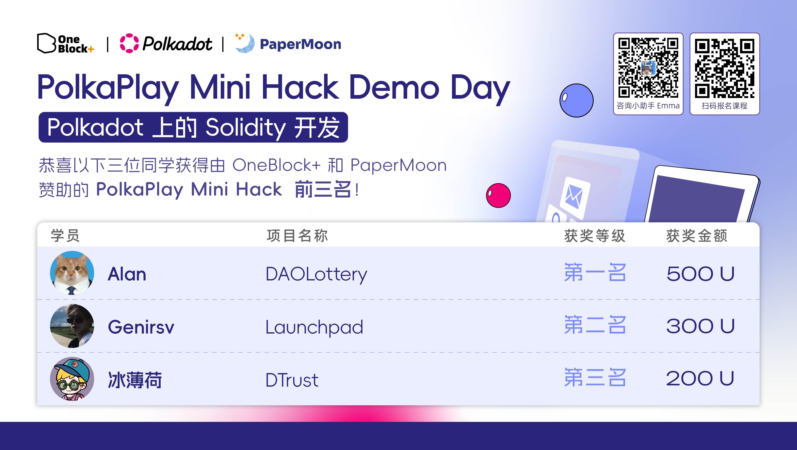

[中 文](./README.md) | [English Version](./README.en.md)

# Hi there 👋

欢迎来到我的 GitHub 主页！

---

## 🧑‍💻 关于我

- **姓名**：genirs  
- **学校**：成都信息工程大学  
- **专业**：区块链工程  
- **兴趣方向**：区块链、AI、Web 开发、算法  
- **主页用途**：记录学习、项目和成长

---

## 🛠 技术栈

- **区块链开发**：Solidity、Hardhat、Ethers.js、智能合约安全、自动化部署与测试  
- **系统级开发**：Rust、WebAssembly（wasm-pack、wasm-bindgen）、多线程优化、性能调优  
- **前端开发**：Vue.js、React、JavaScript、TypeScript、HTML5、CSS3  
- **全栈与集成**：Node.js、前后端一体化开发、API 设计与实现  
- **自动化与脚本**：Shell、npm/yarn 脚本、CI/CD 流程  
- **工具链与协作**：Git、GitHub Actions、Markdown、VSCode  

具备从底层合约到高性能 Web 应用的全流程开发与工程实践能力，注重代码质量与用户体验，善于将新技术应用于实际项目。

---

## 🦀 Rust 相关

- **Rust 语言实践**：熟练掌握 Rust 语法、所有权与生命周期、并发与异步编程，具备系统级开发与高性能工程能力。
- **WebAssembly 集成**：使用 Rust + wasm-pack/wasm-bindgen 构建高性能前端模块，提升 Web 应用性能与安全性。
- **区块链与智能合约**：基于 Rust 进行区块链底层开发，熟悉 Substrate、CosmWasm 等生态，能独立开发和部署链上应用。
- **工程实践**：注重代码安全、性能优化与模块化设计，善于将 Rust 应用于实际项目和创新场景。

---

## 🏆 荣誉与竞赛经历

- **2024 码蹄杯程序设计国赛铜奖**
- **2024 睿抗机器人开发者大赛（RAICOM）四川省编程技能竞赛二等奖**
- **2024 第六届全国高校计算机能力挑战赛（C++科目）全国总决赛三等奖**
- **2024-2025 全国大学生计算机应用能力与数字素养大赛暨第七届传智杯全国IT技能大赛 程序设计挑战赛B组国赛三等奖**
- **2024 四川省计算机能力挑战赛暨第六届全国高校计算机能力挑战赛四川赛区 程序设计挑战赛（C语言科目）四川赛区二等奖**
- **第十五届蓝桥杯全国软件和信息技术专业人才大赛 四川赛区C/C++程序设计大学B组二等奖**
- **第十四届全国大学生电子商务“创新、创意及创业”挑战赛四川省三等奖**

---

## 🎓 创新创业与学科竞赛项目

### 国家级大学生创新创业训练计划（大创）立项项目  
- **项目名称**：元遗孜域——助力非遗文化活态传承  
- **项目编号**：202411661016  
- **项目类型**：创新训练项目  
- **职责与贡献**：  
  担任项目负责人，主导技术方案的设计与实施，重点负责区块链智能合约开发、前端平台构建及用户数据分析模块的实现。  
- **主要成果与影响**：  
  - 基于 Solidity 编写并部署支持 NFT 铸造、交易和版权溯源的智能合约，实现非遗作品的数字化确权与市场流通。  
  - 使用 React 框架开发“非遗文化数字藏品平台”，实现用户浏览、选购与参与文化活动的完整闭环。  
  - 搭建用户行为数据采集分析系统，为非遗推广机构提供数据支持，平台用户活跃度提升超过 20%。  
  - 项目已成功立项为国家级大学生创新创业训练项目，具备良好的社会价值和技术实践深度。

---

### “挑战杯”大学生课外学术科技作品竞赛 四川省三等奖  
- **项目名称**：链接未来——基于“区块链+供应链金融”模式助力纾困中小微企业“三资”难题  
- **竞赛奖项**：“挑战杯”大学生课外学术科技作品竞赛四川省三等奖  
- **职责与贡献**：  
  作为项目成员，参与设计技术方案并实现核心功能模块，聚焦区块链应用在供应链金融场景的落地与优化。  
- **主要成果与影响**：  
  - 深入分析中小微企业在“资金、资产、资源”流通中的痛点，提出基于区块链的信用穿透与多级确权解决方案。  
  - 构建支持多方可信协作的区块链账本体系，集成智能合约、数字凭证、自动结算与风险控制功能。  
  - 项目成果验证表明：可实现融资成本降低 15%、融资效率提升 30%、坏账率下降 10%。  
  - 该作品从全省数百个参赛项目中脱颖而出，获评省级三等奖，体现出团队的创新能力和技术落地能力。

---

### 第十四届全国大学生电子商务“创新、创意及创业”挑战赛四川省三等奖  
- **项目名称**：电商创新创业项目  
- **奖项**：第十四届全国大学生电子商务“创新、创意及创业”挑战赛四川省三等奖  
- **职责与贡献**：参与团队创新项目，主要负责核心技术实现与部分项目方案设计，助力项目获得省级三等奖。

---

## 🚀 代表项目

### dynamic-nft

dynamic-nft 是一个基于 Rust 的动态 NFT 智能合约项目，支持 NFT 属性的链上动态变更，适用于游戏、数字藏品等多种场景。

- **核心技术**：Rust、WebAssembly、区块链智能合约
- **项目亮点**：
  - 使用 Rust 编写智能合约，安全高效，易于维护和扩展
  - 支持 NFT 属性的实时链上更新，实现“活”的数字藏品
  - 适配多种区块链平台，便于集成到不同生态
  - 完善的测试与文档，便于二次开发和社区协作
- **应用场景**：链游装备、动态身份标识、可进化数字艺术品等

---

### oracle

oracle 是一个基于 Sails 框架开发的区块链预言机（Oracle）示例项目，旨在为链上智能合约安全地提供链外数据。作为 Gear 生态系统的基础设施参考实现，适合开发者学习和集成预言机服务。

- **核心技术**：Rust、Sails 框架、区块链预言机
- **项目亮点**：
  - 基于 Gear/Sails 生态，原生支持链上与链下数据交互
  - 提供安全、可扩展的预言机服务，适用于多种区块链应用场景
  - 完善的构建与测试流程，便于二次开发和集成
  - 代码结构清晰，适合学习和参考
- **应用场景**：链上金融、数据喂价、去中心化应用（DApp）等

---

### AutoLaunch

AutoLaunch 是一个基于 Hardhat 的 Launchpad 平台项目，专为代币发行和项目管理而设计。项目获得了 PolkaPlay Mini Hack Demo Day 二等奖。

- 智能合约开发与部署（Solidity + Hardhat）  
- 自动化脚本编写与测试，支持一键部署与功能验证  
- 前后端一体化开发，交互流畅，文档完善  
- 支持多种代币发行场景，便于二次开发和复用  

---

### wasm-game-of-life

wasm-game-of-life 是一个用 Rust 和 WebAssembly 构建的高性能康威生命游戏。

- Rust 编写核心逻辑，wasm-pack 编译为 WebAssembly，极大提升前端性能  
- 支持大规模网格实时模拟，模块化设计，易于扩展  
- wasm-bindgen 实现 Rust 与 JavaScript 的高效互操作  
- 可选集成 React 前端，支持自定义规则和 WebGL 可视化  

[在线体验 wasm-game-of-life](https://lg.dtsci.cn/)

---

### walletVote

walletVote 是一个去中心化的 Web3 数字资产管理平台，专为以太坊及 EVM 兼容链设计。

- 基于 Vue.js 构建现代化前端，界面友好，交互流畅  
- 深度集成 Web3.js，实现与以太坊区块链的无缝交互  
- 支持多种以太坊资产（ERC-20、ERC-721 等）的安全管理  
- 提供 DApp 直连、资产转账、合约交互等核心功能  
- 注重用户体验与安全性，适合 DeFi 和 NFT 用户  

---

## 📫 联系方式

- Email: genirsv@gmail.com

---

> 感谢你的访问，欢迎交流与合作！
